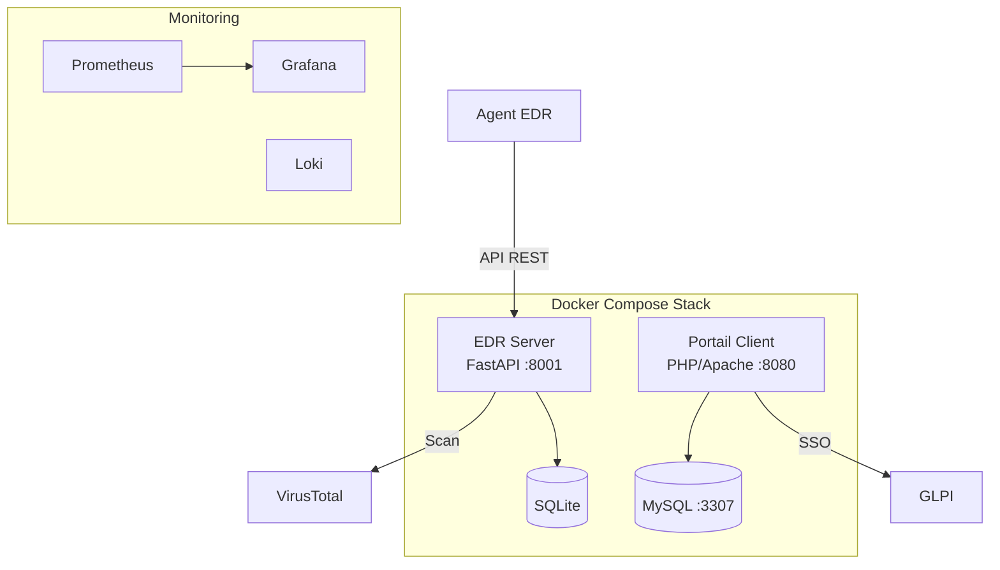

# LockBits — Repo Principal

<p align="center">
  
  
  
</p>

EDR (Endpoint Detection & Response) open-source avec portail client.  
Repo d'orchestration qui regroupe tous les composants via git submodules et publie les images Docker sur [ghcr.io](https://ghcr.io/lockbits-esgi).

## Architecture



## Composants

| Service | Description | Image GHCR | Port |
|---------|-------------|-----------|------|
| **EDR Server** | API REST FastAPI — scan, rapports STIX, VT | `ghcr.io/lockbits-esgi/edr:latest` | 8001 |
| **EDR Agent** | Binaire C/Binaire portable + image Docker | `ghcr.io/lockbits-esgi/edr-agent:latest` | — |
| **Site LockBits** | Portail client PHP 8+/Apache, auth GLPI SSO | `ghcr.io/lockbits-esgi/site_lockbits:latest` | 8080 |
| **MySQL** | Base de données du portail client | `mysql:8.0` | 3307 |

---

## Déploiement distant (images GHCR)

Aucun clone du repo nécessaire. Seuls Docker suffisent.

### 0. Installation express (recommandé)

```bash
curl -fsSL https://raw.githubusercontent.com/Lockbits-ESGI/main/main/install.sh | bash
```

Avec un token GHCR pour les images privées :

```bash
curl -fsSL https://raw.githubusercontent.com/Lockbits-ESGI/main/main/install.sh | GITHUB_TOKEN=<token> bash
```

Le script télécharge les fichiers de config, crée le `.env`, se connecte à GHCR si le token est fourni, lance la stack, et vérifie que tout fonctionne.

Mise à jour rapide plus tard :

```bash
curl -fsSL https://raw.githubusercontent.com/Lockbits-ESGI/main/main/install.sh | bash -s -- --update
```

Mise à jour automatique (cron, toutes les 5 minutes) :

```bash
curl -fsSL https://raw.githubusercontent.com/Lockbits-ESGI/main/main/install.sh | bash -s -- --cron
```

> **Windows (PowerShell) :**
> ```powershell
> iex (iwr -Uri 'https://raw.githubusercontent.com/Lockbits-ESGI/main/main/install.sh').Content
> ```
> ⚠ Nécessite un environnement bash (Git Bash, WSL, ou similaire).

### 1. Installation manuelle — Créer les fichiers de configuration

**Option A — Télécharger depuis GitHub (recommandé)**

```bash
curl -O https://raw.githubusercontent.com/Lockbits-ESGI/main/main/docker-compose.prod.yml
curl -O https://raw.githubusercontent.com/Lockbits-ESGI/main/main/.env.example
cp .env.example .env
# Editer .env avec les vraies valeurs
```

**Option B — Copier directement depuis le README**

<details>
<summary><code>docker-compose.prod.yml</code></summary>

```yaml
# Déploiement production — tire les images depuis ghcr.io, aucun clone requis.
# L'init DB est automatique via le service db-init.
# Usage :
#   docker compose -f docker-compose.prod.yml up -d
#
# Architecture réseau :
#   frontend ── edr-server, site-web    (ports exposés)
#   backend  ── site-web, site-db       (interne, aucun port exposé)

services:

  edr-server:
    image: ghcr.io/lockbits-esgi/edr:latest
    container_name: lockbits_edr
    pull_policy: always
    ports:
      - "${EDR_PORT:-8001}:8000"
    environment:
      SERVER_HOST: "0.0.0.0"
      SERVER_PORT: "8000"
      DATABASE_URL: ${EDR_DATABASE_URL:-sqlite:///./miniedr.db}
      AUTH_TOKEN: ${EDR_AUTH_TOKEN:-}
      VT_ENABLED: ${VT_ENABLED:-false}
      VT_API_KEY: ${VT_API_KEY:-}
      LOG_LEVEL: ${LOG_LEVEL:-INFO}
    volumes:
      - edr_data:/app/data
    networks:
      - frontend
    restart: unless-stopped
    healthcheck:
      test: ["CMD", "curl", "-f", "http://localhost:8000/health"]
      interval: 30s
      timeout: 10s
      retries: 3
      start_period: 15s

  db-init:
    image: ghcr.io/lockbits-esgi/site_lockbits:latest
    container_name: lockbits_init
    pull_policy: always
    depends_on:
      site-db:
        condition: service_healthy
    environment:
      DB_USER: ${DB_USER:-lockbits}
      DB_PASS: ${DB_PASS:-lockbits_password}
      DB_NAME: ${DB_NAME:-lockbits_client}
    entrypoint: >
      echo '>>> Initializing database schema...' &&
      sleep 3 &&
      mysql -h site-db -u "$$DB_USER" -p"$$DB_PASS" "$$DB_NAME"
        < /var/www/html/client/database.sql &&
      echo '>>> Database initialized'
    networks:
      - backend
    restart: "no"

  site-web:
    image: ghcr.io/lockbits-esgi/site_lockbits:latest
    container_name: lockbits_web
    pull_policy: always
    depends_on:
      db-init:
        condition: service_completed_successfully
    ports:
      - "${WEB_PORT:-8080}:80"
    environment:
      DB_HOST: site-db
      DB_PORT: "3306"
      DB_NAME: ${DB_NAME:-lockbits_client}
      DB_USER: ${DB_USER:-lockbits}
      DB_PASS: ${DB_PASS:-lockbits_password}
      APP_NAME: ${APP_NAME:-LockBits Client Area}
      APP_ENV: ${APP_ENV:-production}
      GLPI_API_URL: ${GLPI_API_URL:-}
      GLPI_WEB_URL: ${GLPI_WEB_URL:-}
      GLPI_APP_TOKEN: ${GLPI_APP_TOKEN:-}
      GLPI_USER_TOKEN: ${GLPI_USER_TOKEN:-}
      GLPI_OAUTH_CLIENT_ID: ${GLPI_OAUTH_CLIENT_ID:-}
      GLPI_OAUTH_CLIENT_SECRET: ${GLPI_OAUTH_CLIENT_SECRET:-}
      GLPI_API_USERNAME: ${GLPI_API_USERNAME:-}
      GLPI_API_PASSWORD: ${GLPI_API_PASSWORD:-}
      PHP_MEMORY_LIMIT: ${PHP_MEMORY_LIMIT:-256M}
    networks:
      - frontend
      - backend
    restart: unless-stopped
    healthcheck:
      test: ["CMD", "curl", "-f", "http://localhost/"]
      interval: 30s
      timeout: 10s
      retries: 3
      start_period: 40s

  site-db:
    image: mysql:8.0
    container_name: lockbits_db
    environment:
      MYSQL_ROOT_PASSWORD: ${DB_ROOT_PASSWORD:-root_password}
      MYSQL_DATABASE: ${DB_NAME:-lockbits_client}
      MYSQL_USER: ${DB_USER:-lockbits}
      MYSQL_PASSWORD: ${DB_PASS:-lockbits_password}
    volumes:
      - mysql_data:/var/lib/mysql
    networks:
      - backend
    restart: unless-stopped
    healthcheck:
      test: ["CMD", "mysqladmin", "ping", "-h", "localhost"]
      interval: 30s
      timeout: 10s
      retries: 3
      start_period: 40s

volumes:
  mysql_data:
    driver: local
  edr_data:
    driver: local

networks:
  frontend:
    driver: bridge
  backend:
    driver: bridge
```

</details>

<details>
<summary><code>.env</code></summary>

```bash
# ── EDR Server ───────────────────────────────────────────────────────────
EDR_PORT=8001
EDR_DATABASE_URL=sqlite:///./miniedr.db
EDR_AUTH_TOKEN=
VT_ENABLED=false
VT_API_KEY=
LOG_LEVEL=INFO

# ── LockBits Site ─────────────────────────────────────────────────────────
WEB_PORT=8080
APP_NAME=LockBits Client Area
APP_ENV=production

# Database
DB_NAME=lockbits_client
DB_USER=lockbits
DB_PASS=lockbits_password
DB_ROOT_PASSWORD=root_password
DB_EXPOSE_PORT=3307

# GLPI integration
GLPI_API_URL=
GLPI_WEB_URL=
GLPI_APP_TOKEN=
GLPI_USER_TOKEN=
GLPI_OAUTH_CLIENT_ID=
GLPI_OAUTH_CLIENT_SECRET=
GLPI_API_USERNAME=
GLPI_API_PASSWORD=

# PHP
PHP_MEMORY_LIMIT=256M
```

</details>

### 2. Se connecter à GHCR (images privées)

```bash
echo $GITHUB_TOKEN | docker login ghcr.io -u <github-username> --password-stdin
```

### 3. Déployer

```bash
docker compose -f docker-compose.prod.yml up -d
```

L'initialisation de la base de données (création des tables) est **automatique** via le service `db-init`. Aucune intervention manuelle nécessaire.

### 4. Vérifier

```bash
docker compose -f docker-compose.prod.yml ps
curl http://localhost:8001/health   # EDR → {"status":"ok","db_ok":true}
curl http://localhost:8080/         # Site → 200 OK
```

### Mettre à jour (one-liner)

```bash
curl -fsSL https://raw.githubusercontent.com/Lockbits-ESGI/main/main/install.sh | bash -s -- --update
```

Ce one-liner télécharge la dernière config, détecte les nouvelles variables d'env, et redémarre la stack avec les images les plus récentes.

Alternative si vous avez déjà les fichiers :

```bash
docker compose -f docker-compose.prod.yml up -d
```

Les images sont automatiquement tirées à jour grâce à `pull_policy: always`.

### Mise à jour automatique (cron)

```bash
curl -fsSL https://raw.githubusercontent.com/Lockbits-ESGI/main/main/install.sh | bash -s -- --cron
# ou avec un intervalle personnalisé :
curl -fsSL https://raw.githubusercontent.com/Lockbits-ESGI/main/main/install.sh | bash -s -- --cron --interval=10
```

Ajoute une entrée crontab qui vérifie et applique les mises à jour toutes les 5 minutes (configurable avec `--interval`). Les logs sont dans `./update.log`.

Pour désactiver :

```bash
curl -fsSL https://raw.githubusercontent.com/Lockbits-ESGI/main/main/install.sh | bash -s -- --no-cron
```

### Mettre à jour les submodules (rebuild les images)

Quand vous push sur `edr` ou `site_lockbits`, le repo principal ne voit pas les changements tant que la référence git du submodule n'est pas mise à jour. Pour le faire en une commande :

```bash
# Depuis le clone du repo principal (pas le serveur)
git pull
bash install.sh --update-sources
```

Cette commande met à jour tous les submodules, commit le changement de référence, et push — ce qui déclenche la CI et rebuild les images sur ghcr.io. Une fois les images rebuildées, mettez à jour le serveur avec `--update`.

---

## docker run (services indépendants)

### EDR Server seul

```bash
docker run -d \
  --name lockbits_edr \
  -p 8000:8000 \
  -e DATABASE_URL=sqlite:///./miniedr.db \
  -e VT_ENABLED=false \
  -v edr_data:/app/data \
  ghcr.io/lockbits-esgi/edr:latest
```

Avec VirusTotal et token d'auth :

```bash
docker run -d \
  --name lockbits_edr \
  -p 8000:8000 \
  -e DATABASE_URL=sqlite:///./miniedr.db \
  -e VT_ENABLED=true \
  -e VT_API_KEY=<votre_clé_vt> \
  -e AUTH_TOKEN=<token_secret> \
  -v edr_data:/app/data \
  ghcr.io/lockbits-esgi/edr:latest
```

### Site LockBits seul (nécessite MySQL)

```bash
# 0. Créer le réseau (une seule fois)
docker network create lockbits_network

# 1. MySQL
docker run -d \
  --name lockbits_db \
  --network lockbits_network \
  -e MYSQL_ROOT_PASSWORD=root_password \
  -e MYSQL_DATABASE=lockbits_client \
  -e MYSQL_USER=lockbits \
  -e MYSQL_PASSWORD=lockbits_password \
  -v mysql_data:/var/lib/mysql \
  mysql:8.0

# 2. Site
docker run -d \
  --name lockbits_web \
  --network lockbits_network \
  -p 8080:80 \
  -e DB_HOST=lockbits_db \
  -e DB_NAME=lockbits_client \
  -e DB_USER=lockbits \
  -e DB_PASS=lockbits_password \
  ghcr.io/lockbits-esgi/site_lockbits:latest
```

---

## Développement local (build depuis les sources)

```bash
git clone --recurse-submodules git@github.com:Lockbits-ESGI/main.git
cd main
cp .env.example .env
docker compose up -d        # build + run
docker compose logs -f
```

---

## CI/CD

Le workflow `.github/workflows/build-and-push.yml` se déclenche sur chaque push sur `main` :

```
test-edr-unit ──> test-edr-integration ──> build-edr (ghcr.io/lockbits-esgi/edr:latest)
test-site-smoke ─────────────────────────> build-site (ghcr.io/lockbits-esgi/site_lockbits:latest)
```

Les images sont publiées en `linux/amd64` + `linux/arm64`.

## Mise à jour des submodules

**Automatique** : un workflow GitHub vérifie toutes les heures si les submodules ont de nouveaux commits. Si oui, il met à jour la référence, commit et push — ce qui déclenche le rebuild des images. Aucune action manuelle nécessaire.

**Manuel** (si besoin immédiat) :

```bash
bash install.sh --update-sources
```

Ou :

```bash
git submodule update --remote
git add -u
git commit -m "update submodules"
git push
```

Après le push (auto ou manuel), la CI rebuild les images sur ghcr.io. Le serveur de prod les récupère automatiquement via le cron `--cron` (toutes les 5min) ou manuellement avec `--update`.

## Installation de l'agent EDR

Installez l'agent de sécurité LockBits sur vos machines Linux pour une protection en temps réel.

### Prérequis

- Linux x86_64 (amd64) ou ARM64 (aarch64)
- Accès réseau au serveur EDR (variable SERVER_URL)

### Installation (mode binaire — recommandé)

```
curl -fsSL https://raw.githubusercontent.com/Lockbits-ESGI/main/main/install-agent.sh | \
  SERVER_URL=https://votre-edr.example.com AUTH_TOKEN=votre-token bash
```

Remplacez https://votre-edr.example.com par l'URL de votre serveur EDR et votre-token par le token d'authentification de votre client.

> 💡 La commande exacte est disponible sur votre dashboard client LockBits, dans la section **🔒 EDR Agents**.

### Installation (mode Docker)

```
curl -fsSL https://raw.githubusercontent.com/Lockbits-ESGI/main/main/install-agent.sh | \
  SERVER_URL=https://votre-edr.example.com AUTH_TOKEN=votre-token bash -s -- --mode docker
```

Le mode Docker nécessite que Docker soit installé sur la machine cible.

### Mise à jour de l'agent

```
# Mode binaire
sudo /opt/lockbits-agent/lockbits-agent --update

# Mode Docker
docker pull ghcr.io/lockbits-esgi/edr/lockbits-agent:latest
```

### Désinstallation

```
# Mode binaire
sudo /opt/lockbits-agent/lockbits-agent --uninstall

# Mode Docker
docker stop lockbits-agent && docker rm lockbits-agent
```

> Les binaires sont distribués via les GitHub Releases et mis à jour à chaque push sur main.
